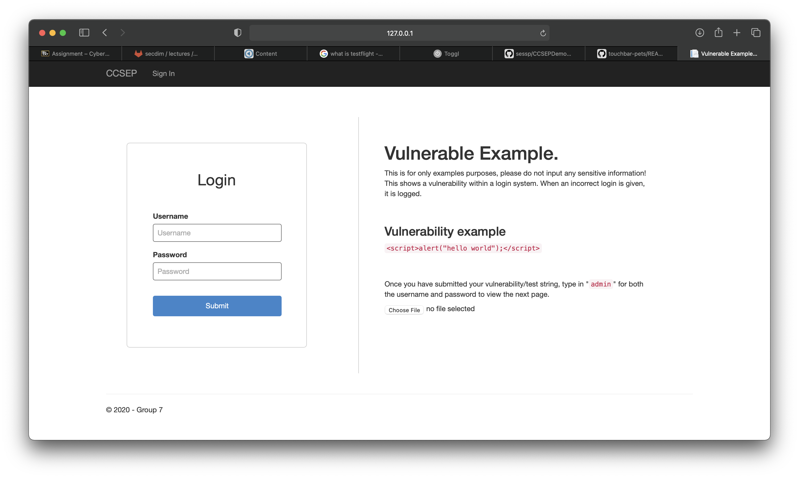

# TODO 
program description, how to run the program, how to detect, exploit and patch the bug

# Group 7 - CCSEP Demo

## About 

Cross-site scripting is a widespread breed of web vulnerabilities which allows hackers to inject malicious code from their untrusted websites into the webpages that are are being viewed by unknowing victims.

## Google slides

* https://docs.google.com/presentation/d/1B_Zfi9v9PkJHw7hkjxCTDZ8ytnqP8fqlb0EMikIOrVw/edit?usp=sharing

## Credits

* Rares Popa - 19159700
* Peter Sessarego - 19127639
* Sebastian Ng - 19092986

## Prerequisites 

* Visual Studio

## How to run

* Download the app.
* Afterwards, Open Visual Studio
* Then, File>Open click the folder and click the .sln
* Press start button and it will run within Visual Studio
* Open a new browser window and go to http://127.0.0.1:8080

## Problems

If you're having any problems feel free to contact me! 19159700@student.curtin.edu.au
